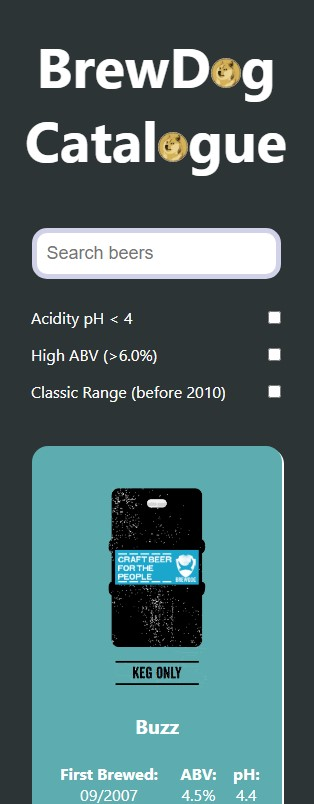

# Punk API Project

This repository holds the Punk API [front-end](https://kav97.github.io/punk-api/) project and is created using React. To view the documentation of the Punk API, click [here](https://punkapi.com/documentation/v2).

## Quickstart:

1. Install the dependencies with `npm install`

2. Run the application with `npm start`

 

## About the project 💭

- I was tasked with creating website based on the Brewdog Catalogue using the Punk API.
- Initially I used [beers.js](https://gist.github.com/DanForder/63698b304305a96595dfb1b45f81e486) as a sample file to start project.
- Once I got the information I needed from beers.js and the overall design set out. I called down the beers from the API using the GET endpoint and its relevant URL parameters (later for filtering).

 

## Project View 📱

 

| Mobile View | Desktop View |
|:---:|:---:|
|| |

 

## Future improvements 🌟
- I would like to include pagination to my app. This would allow for smaller and elegant design. Also, increase the speed of rendering all the beer cards.
- Routing each card to a new page using its unique ID; to display more information about a selected beer.